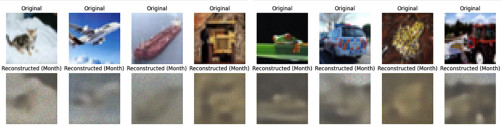

# AnalogNAS

## Description
**AnalogNas** is a modular and flexible framework to facilitate the implementation of Analog-aware Neural Architecture Search. It offers high-level classes to define: the search space, the accuracy evaluator, and the search strategy. It leverages [the aihwkit framework](https://github.com/IBM/aihwkit) to apply hardware-aware training with analog non-idealities and noise included. **AnalogNAS** obtained architectures are more robust during inference on Analog Hardware. We also include two evaluators trained to rank the architectures according to their analog training accuracy. 

> :warning: This library is currently in beta and under active development.
> Please be mindful of potential issues and monitor for improvements,
> new features, and bug fixes in upcoming versions.

[**Setup**](#setup)
| [**Usage**](#usage)
| [**Docs**](https://github.com/IBM/analog-nas/blob/main/starter_notebook.ipynb)
| [**References**](#references)

## Additions for HPML Class
Our project focused on creating an AutoEncoder architecture that can be optimized for Analog Hardware. 
We created a search space for AutoEncoder architectures and another for RPU-configurations that can be used to run AutoEncoder architectures.
As part of the project, we also created new evaluators that can be used to evaluate the performance of the AutoEncoder architectures.

We used the existing infrastructure of this repo and made some key contributions to it to extend the functionality for this project.

The majority of the code relevant to this project can be found within the analagainas main folder. Within that main folder, there are the following subfolders:

* **search_spaces**: Contains a further subfolder that contains the AutoEncoder implementation details along with the associated configuration space for the AutoEncoder. Also contains new additions to the dataloader subfolder by the team.
* **evaluators**: Contains the new and existing evaluators that are used to evaluate the performance of the models. The new ones added by the team are the RealtimeRpuEvaluator and the RealtimeTrainingEvaluator.
* **search_algorithms**: Contains the search algorithms that are used to search for the optimal architecture. Contains separate py files for the various approaches. In particular, contains EAOptimized.py which is the main search algorithm used for the AutoEncoder.

Here is a more specific look at the additions made to the repo:


- RealtimeTrainingEvaluator
    - Architecture-batchable evaluator class that integrates with the existing AnalogNAS optimizer search framework through query and query\_pop implementations. Allows for multiple architectures to be training on several GPUs simultaneously on multiple threads. Implemented to be model and dataset-agnostic. The outputs of this class could be used in the future to train estimators for arbitrary models.

- BaseConfigSpace
    - Introduced Object Oriented update to ConfigSpaces. Made it easily extensive to add future ConfigSpaces without having to update a single catch-all class.

- AutoEncoderConfigSpace
    - Configuration Space for the AutoEncoder architecture that was defined in Methodology.

- AutoEncoder
    - Config-driven AutoEncoder implementation that accepts parameters as defined by the corresponding ConfigSpace. Used construction-based approach to create the CIFAR and MNIST task-specific configurable AutoEncoders.

- RPUConfigSpace
    - Configuration Space for the RPU Architectures. 

- Search Entrypoints
    - Introduced several training entrypoints to enable the recreation of various search experiments. These include, AutoEncoder Search Demo, Cifar AutoEncoder Train Demo, and RPU Search Demo. These can launch various searches over different datasets/architectures.

- Jupyter Notebooks
    - Several Jupyter notebooks were created to analyze/retrain discovered architecture and generate experiment results.

Much like the original implemenation, you can run the searches by running the following commands:

* python nas_search_demo.py
* python autoencoder_search_demo.py
* python rpu_search_demo.py
* python cifar_autoencoder_train.py

Here is a sample snippet:

```python
import torchvision
import torchvision.transforms as transforms
from torch.utils.data import DataLoader
import torch.nn as nn

from analogainas.search_spaces.autoencoder.cifar_autoencoder import CifarAutoEncoder
from analogainas.search_spaces.autoencoder.autoencoder_config_space import AutoEncoderConfigSpace
from analogainas.evaluators.realtime_training_evaluator import RealtimeTrainingEvaluator
from analogainas.search_algorithms.ea_optimized import EAOptimizer
from analogainas.search_algorithms.worker import Worker
from analogainas.search_spaces.dataloaders.autoencoder_structured_dataset import AutoEncoderStructuredDataset


CS = AutoEncoderConfigSpace()

print(CS.get_hyperparameters())

print(CS.compute_cs_size())

transform = transforms.Compose([
    transforms.ToTensor(),
    transforms.Normalize((0.4914, 0.4822, 0.4465),
                         (0.2023, 0.1994, 0.2010))
])

train_cifar_dataset = AutoEncoderStructuredDataset(
    torchvision.datasets.CIFAR10(root='./data', train=True, transform=transform, download=True)
)

train_dataloader = DataLoader(train_cifar_dataset, batch_size=8, shuffle=True)

test_cifar_dataset = AutoEncoderStructuredDataset(
    torchvision.datasets.CIFAR10(root='./data', train=False, transform=transform, download=True)
)

test_dataloader = DataLoader(test_cifar_dataset, batch_size=64, shuffle=True)

criterion = nn.MSELoss()
evaluator = RealtimeTrainingEvaluator(model_factory=CifarAutoEncoder, train_dataloader=train_dataloader, val_dataloader=test_dataloader, test_dataloader=test_dataloader, criterion=criterion, epochs=13, artifact_dir='CifarAutoEncoderTraining')

optimizer = EAOptimizer(evaluator, population_size=50, nb_iter=10, batched_evaluation=True)

NB_RUN = 1
worker = Worker(network_factory=CifarAutoEncoder, cs=CS, optimizer=optimizer, runs=NB_RUN)

print(worker.config_space)
worker.search()
``` 

Sample results:

Virtually all of the models were able to fit the MNIST dataset in the digital prediction space.


However, for the vast majority of models, once even a little RPU drift noise was added, the models lost all predictive power.


Results after one day of drift noise on non-optimal model:


Results after one month of drift noise on non-optimal model:


However, after we conducted the search, we were able to find an architecture that is resilient to the drift noise.

Results after one day of drift noise on optimal model:


Results after one month of drift noise on optimal model:


Clearly the evolved architecture is much preferred in this case.

This was attempted again with Cifar10. 

Here are the results for the non-optimal model:

One day


One month



And here are the results for the optimal model:

One day


One month


It should be added that even these "non-optimal" models are still better than the average, randomly selected model from the configuration space. 
Many of the models are completely illegible after adding noise.

The optimal models are able to maintain a high level of clarity even after a month of drift noise.

Lastly, with the optimized model, we conducted an RPU search for the optimal RPU config and achieved the following results:


## Features 
AnalogaiNAS package offers the following features: 

* A customizable resnet-like search space, allowing to target CIFAR-10, Visual Wake Words, and Keyword Spotting 
* A configuration space object allows to add any number or type of architecture and training hyperparameters to the search 
* An analog-specific evaluator which includes: 
  * An 1-day accuracy ranker 
  * An 1 month accuracy variation estimator 
  * A 1-day standard deviation estimator 
* A flexible search algorithm, enabling the implementation and extension of state-of-the-art NAS methods. 

## Structure 
In a high-level AnalogAINAS consists of 4 main building blocks which (can) interact with each other:

* Configuration spaces (```search_spaces/config_space.py```): a search space of architectures targeting a specific dataset.
* Evaluator (```evaluators/base_evaluator.py```): a ML predictor model to predict: 
    * 1-day Accuracy: the evaluator models the drift effect that is encountered in Analog devices. The accuracy after 1 day of drift is then predicted and used as an objective to maximize. 
    * The Accuracy Variation for One Month (AVM): The difference between the accuracy after 1 month and the accuracy after 1 sec. 
    * The 1-day accuracy standard deviation: The stochasticity of the noise induces different variation of the model's accuracy depending on its architecture. 
    
    The weights of these models are provided in (```evaluators/weights```).
* Optimizer (```search_algorithms/```): a optimization strategy such as evolutionary algorithm or bayesian optimization. 
* Worker (```search_algorithms/worker.py```): A global object that runs the architecture search loop and the final network training pipeline

## Setup 
While installing the repository, creating a new conda environment is recomended.

Firstly, refer to [AIHWKit installation](https://aihwkit.readthedocs.io/en/latest/install.html) to install Pytorch and the AIHWKit toolkit. 

Install the additional requirements, using:
```
pip install -r requirements.txt 
```

Afterwards, install AnalogNAS by running the ```setup.py``` file:
``` 
python setup.py install 
```

Alternatively, you can also download the package through pip: 
```
pip install analogainas
```

## Example 

```python
from analogainas.search_spaces.config_space import ConfigSpace
from analogainas.evaluators.xgboost import XGBoostEvaluator
from analogainas.search_algorithms.ea_optimized import EAOptimizer
from analogainas.search_algorithms.worker import Worker

CS = ConfigSpace('CIFAR-10') # define search space, by default a resnet-like search space 
evaluator = XGBoostEvaluator() # load the evaluators 
optimizer = EAOptimizer(evaluator, population_size=20, nb_iter=10)  # define the optimizer with its parameters 

NB_RUN = 2
worker = Worker(CS, optimizer=optimizer, runs=NB_RUN) # The global runner 

worker.search() # start search

worker.result_summary() # print results 

``` 

## Usage
To get started, check out ```nas_search_demo.py``` and ```starter_notebook.ipynb``` to ensure the installation went well. 

## Authors 
AnalogNAS has been developed by IBM Research, 

with Hadjer Benmeziane, Corey Lammie, Irem Boybat, Malte Rasch, Manuel Le Gallo, 
Smail Niar, Hamza Ouarnoughi, Ramachandran Muralidhar, Sidney Tsai, Vijay Narayanan, 
Abu Sebastian, and Kaoutar El Maghraoui

You can contact us by opening a new issue in the repository. 

## How to cite?

In case you are using the _AnalogNas_ toolkit for
your research, please cite the IEEE Edge 2023 paper that describes the toolkit:

> Hadjer Benmeziane, Corey Lammie, Irem Boybat, Malte Rasch, Manuel Le Gallo,
> Hsinyu Tsai, Ramachandran Muralidhar, Smail Niar, Ouarnoughi Hamza, Vijay Narayanan,
> Abu Sebastian and Kaoutar El Maghraoui
> "AnalogNAS: A Neural Network Design Framework for Accurate Inference with Analog In-Memory Computing" (2023 IEEE INTERNATIONAL CONFERENCE ON EDGE
> COMPUTING & COMMUNICATIONS (IEEE Edge))

> https://arxiv.org/abs/2305.10459


## Awards and Media Mentions 

* We are proud to share that AnalogNAS open source project the prestigious **IEEE OPEN SOURCE SCIENCE** in 2023 at the [IEEE 2023 Services Computing Congress](https://conferences.computer.org/services/2023/awards/).
  
 
 
* AnalogNAS paper received the **Best Paper Award** at [2023 IEEE EDGE (INTERNATIONAL CONFERENCE ON EDGE COMPUTING & COMMUNICATIONS)](https://conferences.computer.org/edge/2023/)

  

  


## References
* [Hardware-aware Neural Architecture Search: Survey and Taxonomy](https://www.ijcai.org/proceedings/2021/592)
* [AIHWKit](https://ieeexplore.ieee.org/abstract/document/9458494)
* [AIHW Composer](https://aihw-composer.draco.res.ibm.com)

## License
This project is licensed under [Apache License 2.0].

[Apache License 2.0]: LICENSE.txt
