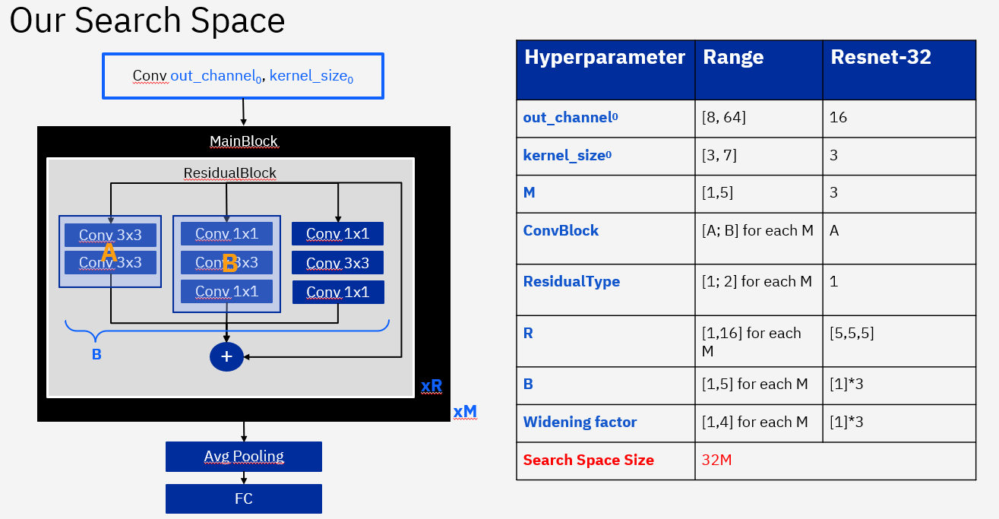

# Analog-NAS-Bench 
This repository contains the code used for generating and interacting with the Analog-NAS-Bench. 
The complete search space contains 32M architectures. 
We trained a surrogate model on 864 architectures. 

Each network is trained and evaluated multiple times on CIFAR-10, VWW, Google Speech Command.
We present the metrics in a queriable API. If the architecture wasn't trained, the API will output the surrogate model's prediction. 
You can force the API to only iterate over trained architectures with ```dataset_only=True```. 

## Macro-architecture 


